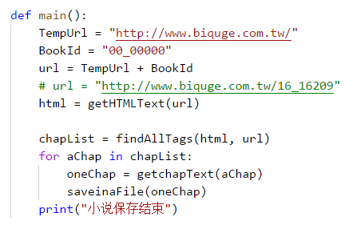
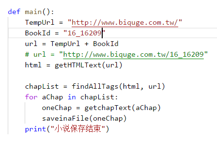

分章节下载笔趣阁小说
====
+ 分章节爬取[笔趣阁小说网](http://www.biquge.com.tw/)
+ 语言：python3
+ 自带库：
    + re
+ 第三方库：
    + beautifulsoup4
    + requests
+ **请注意python版本及第三方库是否安装可用**

----
## 使用方法
>下载源码后，将想下载的小说代码替换原main()函数中的BookId变量(初始值为00_00000)

>然后双击运行或者在控制台(终端)中输入python BQG.py